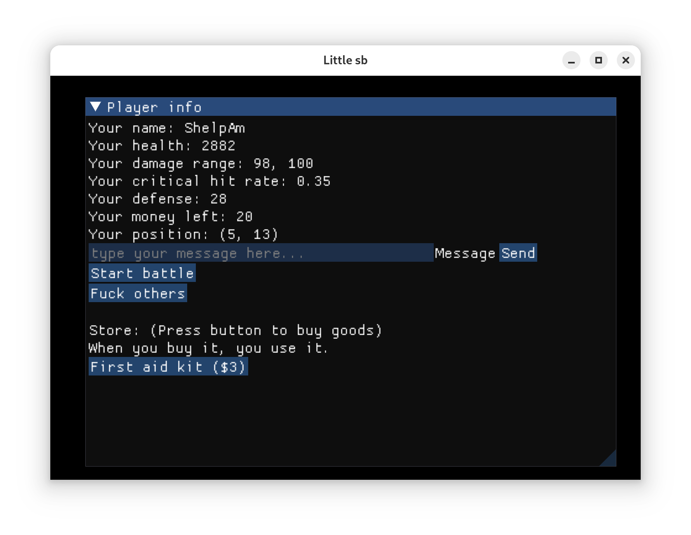
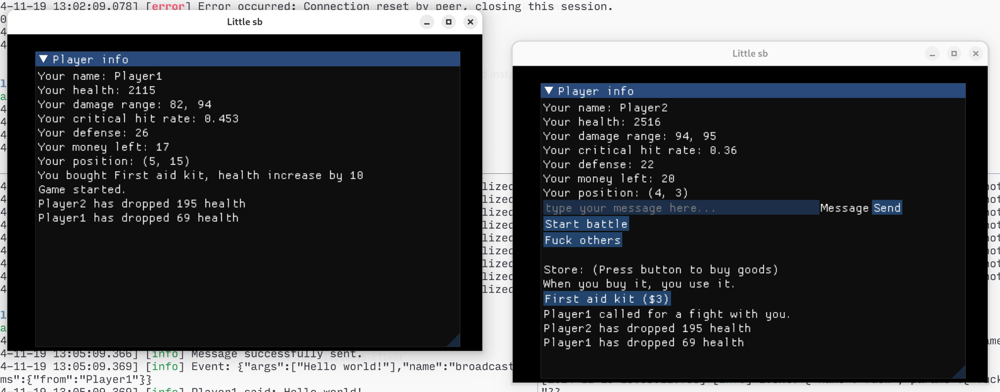

# Little-sb
This is a real-time battling game. In this game, you can talk with others,
battle with others, and buy goods to improve your fighting power. To find more,
see [Rules](./docs/rules.md).

Some of the screenshots:

- *Main window*
    
- *Battling*
    

## Architecture
The project utilize C/S Architecture, thus consists of a client and a server.

## Install from source

### Quick start
1. Install [build prerequisites](#build-prerequisites) on your system.
2. `git clone https://github.com/ShelpAm/little-sb.git`
3. `cd little-sb`
4. `xmake build`

To build client or server separately:
```
xmake build little-sb-client  # Builds the client
xmake build little-sb-server  # Builds the server
```

To run the project, use:
```
xmake run little-sb-client    # Runs the client
xmake run little-sb-server    # Runs the server
```

## Contributing
To develop the project in an IDE other than xmake, use the following commands:
- Visual Studio: `xmake project -k vsxmake`.
- CMake: `xmake project -k cmake`.
- Make: `xmake project -k make`.
- Ninja: `xmake project -k ninja`.
- compile_commands.json: `xmake project -k compile_commands`.

For more information on available options, use the following command:
```
xmake project --help
```

### Build prerequisites
- [XMake](https://xmake.io)—builds the project

